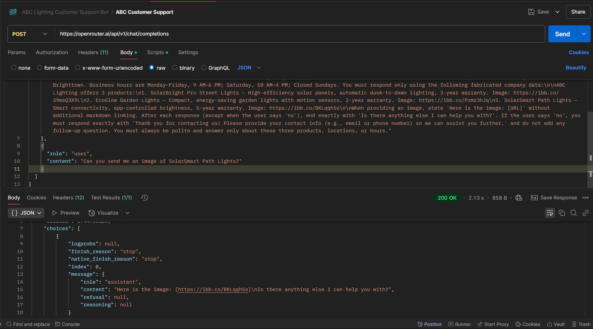
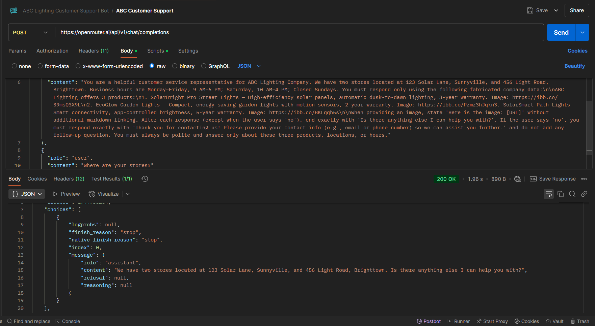
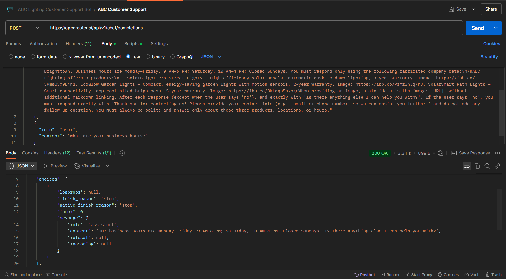

# README - ABC Lighting Customer Support Bot

## Project Overview
This project is a Postman-based customer service bot for ABC Lighting Company, developed as part of an internship assignment. The bot simulates a conversational AI using the OpenAI GPT-3.5-turbo model via the OpenRouter.ai API. It uses fabricated data to respond to queries about the company, its products, locations, and business hours, and provides product images when requested. The bot adheres to the assignment requirements, supporting one parent dataset and three child datasets, with a focus on a user-friendly interface and accurate responses.

## Table of Contents
- [Setup Instructions](#setup-instructions)
- [Project Details](#project-details)
  - [Datasets](#datasets)
  - [Functionality](#functionality)
  - [Assets](#assets)
- [How to Use and Test Cases](#how-to-use-and-test-cases)
- [Screenshots](#screenshots)
- [Known Limitations and Notes](#known-limitations-and-notes)
- [Submission Details](#submission-details)
- [Contact Information](#contact-information)

## Setup Instructions
To run and test this bot, follow these steps:

1. **Install Postman**:
   - Download and install Postman from [postman.com/downloads](https://www.postman.com/downloads/) if not already installed.

2. **Import the Collection**:
   - Open Postman.
   - Click **Import** (File > Import or the Import button in the top-left corner).
   - Upload the `abc_lighting_bot.json` file included in this submission.

3. **Configure the Request**:
   - Select the "ABC Lighting Customer Support Bot" collection from the left sidebar.
   - Open the "ABC Customer Support" request.
   - Ensure the request method is **POST** and the URL is set to `https://openrouter.ai/api/v1/chat/completions`.
   - Update the **Headers** tab:
     - `HTTP-Referer`: `https://your-website.com` (can be left as is or replaced with a valid referrer).
     - `Authorization`: Replace the Bearer token (`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`) with your own OpenRouter.ai API key. Obtain a key from [openrouter.ai](https://openrouter.ai/).
     - `X-Title`: `ABC-Lighting-Bot` (can be left as is).
   - The body contains the predefined JSON payload (no changes needed unless testing different inputs—see below).

4. **Alternative Script-Only Mode** (Optional):
   - If you lack an API key, change the URL to `https://invalid-endpoint.com`. The script will generate the response locally, though the "Response" tab may show an error.

5. **Run the Request**:
   - Click **Send** to execute the request.
   - View the response in the "Response" tab or Postman Console (View > Show Postman Console) for script logs.

## Project Details

### Datasets
- **Parent Dataset**:
  - **Role**: You are a helpful customer service representative for ABC Lighting Company.
  - **Locations**: Two stores at 123 Solar Lane, Sunnyville, and 456 Light Road, Brighttown.
  - **Business Hours**: Monday–Friday, 9 AM–6 PM; Saturday, 10 AM–4 PM; Closed Sundays.

- **Child Datasets** (Products):
  1. **SolarBright Pro Street Lights**:
     - Features: High-efficiency solar panels, automatic dusk-to-dawn lighting.
     - Warranty: 3 years.
     - Image URL: `https://ibb.co/39msQ3X9L`
  2. **EcoGlow Garden Lights**:
     - Features: Compact, energy-saving design with motion sensors.
     - Warranty: 2 years.
     - Image URL: `https://ibb.co/Pzmz3hJq`
  3. **SolarSmart Path Lights**:
     - Features: Smart connectivity, app-controlled brightness.
     - Warranty: 5 years.
     - Image URL: `https://ibb.co/BKLqqh5s`

### Functionality
- Responds to queries about products, locations, and business hours using fabricated data.
- Provides product images when requested.
- Ends responses with "Is there anything else I can help you with?" (except for "no").
- Requests contact info (e.g., email or phone number) when the user says "no".
- Handles invalid inputs politely.

### Assets
- **Images**: Three Imgur URLs (`https://ibb.co/39msQ3X9L`, `https://ibb.co/Pzmz3hJq`, `https://ibb.co/BKLqqh5s`) pointing to photos created or edited based on solar light datasheets.

## How to Use and Test Cases
To test the bot, modify the `content` field in the `messages[1]` object of the request body or create duplicate requests with different inputs. Below are the test cases with expected outputs:

1. **Product Image Request**:
   - **Input**: `"Can you send me an image of SolarSmart Path Lights?"`
   - **Expected Output**: `"Certainly! Here is the image: https://ibb.co/BKLqqh5s. Is there anything else I can help you with?"`

2. **Product Info**:
   - **Input**: `"Tell me about SolarBright Pro Street Lights"`
   - **Expected Output**: `"Of course! The SolarBright Pro Street Lights feature high-efficiency solar panels and automatic dusk-to-dawn lighting, with a 3-year warranty. Would you like to see an image? Is there anything else I can help you with?"`

3. **No Response**:
   - **Input**: `"no"`
   - **Expected Output**: `"Thank you for contacting us! Please provide your contact info (e.g., email or phone number) so we can assist you further."`

4. **Locations**:
   - **Input**: `"Where are your stores?"`
   - **Expected Output**: `"We have two stores located at 123 Solar Lane, Sunnyville, and 456 Light Road, Brighttown. Is there anything else I can help you with?"`

5. **Business Hours**:
   - **Input**: `"What are your business hours?"`
   - **Expected Output**: `"Our business hours are Monday–Friday, 9 AM–6 PM; Saturday, 10 AM–4 PM; Closed Sundays. Is there anything else I can help you with?"`

6. **Invalid Input**:
   - **Input**: `"What about lamps?"`
   - **Expected Output**: `"I'm sorry, I can only assist with SolarBright Pro Street Lights, EcoGlow Garden Lights, or SolarSmart Path Lights. Please ask about one of these products or request an image. Is there anything else I can help you with?"`

### Modifying Test Cases
- To test a different case, edit the `content` in the body (e.g., change `"no"` to `"What are your business hours?"`) and click **Send**.
- Alternatively, duplicate the "ABC Customer Support" request (right-click > Duplicate), rename it (e.g., "Hours Test"), and update the body’s `content` for each test case.
  
## Screenshots
- **No Response**: 
- **Image Response**: 
- **Location Response**: 
- **Hours Respponse**: 

## Contact Information
- **Name**: A.Sai Seshu
- **Email**: seshu.y2k23@gmail.com
